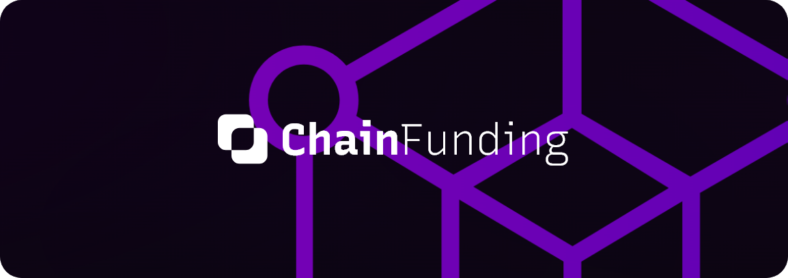

# ChainFunding DApp

  <strong>🖥️ DApp Projekt</strong> 
  Technische Hochschule Würzburg-Schweinfurt 
  Modul: Blockchain und Smart Contracts 

## 📖 Content

- [Client](#-client)
  - [Packages and technologies](#-packages-and-technologies)
  - [Folder structure](#-folder-structure)
  - [Page components](#-page-components)
  - [Reusable components](#-reusable-components)
  - [Contexts](#-contexts)
- [Web 3](#-web-3)
- [TODO](#-todo)
- [Bugs](#-bugs)
- [Authors](#-authors)

## 💻 Client

This is the front-end of the application.

### 📦 Packages and technologies

- [React](https://reactjs.org/) - For constructing the front-end
- [React Router](https://reactrouter.com/en/main) - Basic routing between pages
- [Vite](https://vitejs.dev/) - Front-end tooling
- [Unidecode](https://www.npmjs.com/package/unidecode) - Helps search function by converting umlauts and other special characters to standard latin alphabet
- [Ethers](https://www.npmjs.com/package/ethers) - Ethereum tools
- [Thirdweb](https://thirdweb.com/) - Simplifies smart contract creation and communication processes
- [jdenticon](https://jdenticon.com/) - Creates unique profile pictures for every address
- [Microsoft fluent icons](https://fluenticons.co/) - UI icons
- [NodeJS](https://nodejs.org/en/) - Package manager
- [NPM](https://www.npmjs.com/) - Package manager
- [Recursive](https://www.recursive.design/) - Cool font used everywhere

### 📁 Folder structure

- [`client`](/client/) - All client files
- [`client/src`](/client/src) - All source files and main entry of React app
- [`client/src/assets`](/client/src/assets/) - All non programmatic asset files
- [`client/src/assets/favicon`](/client/src/assets/favicon) - Favicons of the app
- [`client/src/assets/fonts`](/client/src/assets/fonts) - All fonts
- [`client/src/assets/img`](/client/src/assets/img) - All bitmap images (Metamask icon, tutorial images)
- [`client/src/components`](/client/src/components) - Reusable react components
- [`client/src/context`](/client/src/context) - React context files
- [`client/src/pages`](/client/src/pages) - All app pages
- [`client/src/temp`](/client/src/temp) - Old smart contracts
- [`client/src/utils`](/client/src/utils) - Utility files and jdenticon

### 🗃️ Page components

#### React starting point

Starting point located in [`client/src`](/client/src)

- [`main.jsx`](/client/src/main.jsx) - React starting point
- [`App.jsx`](/client/src/App.jsx) - Displays Navbar, current page through routes, and footer

#### Pages in routes

All page components are stored in [`client/src/pages`](/client/src/pages)

- [`CreateProject.jsx`](/client/src/pages/CreateProject.jsx) - Page for creating a crowdfunding project
- [`GetStarted.jsx`](/client/src/pages/GetStarted.jsx) - Shows helpful information to new users
- [`Home.jsx`](/client/src/pages/Home.jsx) - Homepage of app
- [`Profile.jsx`](/client/src/pages/Profile.jsx) - If user is connected it shows users projects and if they are completed he can also withdraw funds from here.
- [`ProjectDetails.jsx`](/client/src/pages/ProjectDetails.jsx) - Shows project details if user clicked on a card. Gets information from previous screen passed in the url and React `useLocation` hook
- [`Search.jsx`](/client/src/pages/Search.jsx) - Lets user search projects and displays matches in title and description. Gets search prompt from navbar [`Searchbox.jsx`](/client/src/components/navbar/Searchbox.jsx) component passed in the the  and React `useLocation` hook

### 🗂️ Reusable components

#### Global

Components in [`client/src/components/global`](/client/src/components/global) used by all pages and components

- [`AccentButton.jsx`](/client/src/components/global/AccentButton.jsx) - Main purple button component
- [`Card.jsx`](/client/src/components/global/Card.jsx) - A card component that displays a project (used in lists)
- [`Footer.jsx`](/client/src/components/global/Footer.jsx) - Main app footer that displays the logo and links to every part of the app
- [`Loader.jsx`](/client/src/components/global/Loader.jsx) - Animated loading spinner with customizable text
- [`Logo.jsx`](/client/src/components/global/Logo.jsx) - App logo that takes user to homepage on click
- [`NotificationWindow.jsx`](/client/src/components/global/NotificationWindow.jsx) - Displays a window showing the user customizable information and a button

#### Navbar

Components in [`client/src/components/navbar`](/client/src/components/navbar) used in the component [`Navbar.jsx`](/client/src/components/navbar/Navbar.jsx)

- [`Navbar.jsx`](/client/src/components/navbar/Navbar.jsx) - Main app navbar
- [`ProfileIcon.jsx`](/client/src/components/navbar/ProfileIcon.jsx) - Displays user profile picture and taskes them to the [`Profile.jsx`](/client/src/pages/Profile.jsx) page on click
- [`Searchbox.jsx`](/client/src/components/navbar/Searchbox.jsx) - Search box that takes user to [`Search.jsx`](/client/src/pages/Search.jsx) page when prompt entered and enter button is pressed

#### Project details

Components in [`client/src/components/projectDetails`](/client/src/components/projectDetails) used by page [`ProjectDetails.jsx`](/client/src/pages/ProjectDetails.jsx)

- [`DonatorRow.jsx`](/client/src/components/projectDetails/DonatorRow.jsx) - Displays a donator address and the amount donated (to be used in lists)

#### Create project

Components in [`client/src/components/createProject`](/client/src/components/createProject) used by page [`CreateProject.jsx`](/client/src/pages/CreateProject.jsx)

- [`TextField.jsx`](/client/src/components/createProject/TextField.jsx) - Text field with label and icon

### 🌯 Contexts

- [contractInterface.jsx](/client/src/context/contractInterface.jsx) - Context that offers child components functions and variables of the smart contract
- [dummyDonators.js](/client/src/context/dummyDonatorList.js) - Temporary file that gets used in [contractInterface.jsx](/client/src/context/contractInterface.jsx) for displaying project donators. An old contract version saved the donators but it used too much gas. Not implemented yet in current contract.

## 🕸️ Web 3

The smart contract is in [`/web3/contracts`](/web3/contracts) and originates from [here](https://github.com/BestFighter8/CrowdFunding_Dapp/blob/master/contracts/CrowdfundingCampaign.sol).

Smart contract was deployes with [Thirdweb](https://thirdweb.com/) and the dashboard of the contract can be found [here](https://thirdweb.com/goerli/0xa3162CAfDFbC006A2350C575872042ea22F38c9D/)

## ✅ TODO

- Store project details in back-end a database, using an id to match it with counterpar in the smart contract
- Implement refund better with a web worker or something like that
- Optimize search by using back-end database instead of smart contract
- Store more user data in back-end database, like name, bio, etc.
- Redo `GetStarted.jsx` page with more details and tutorials
- Create `About.jsx` page
- Create algorythm that shows user more relevant projects
- Project tags like "technnology", "social" etc.
- More notifications on actions
- Better form checking so no wrong values can be passed
- Also allow [Coinbase Wallet](https://www.coinbase.com/wallet) to be connected
- Allow user to use more than one image for project
- Reimplement donators list in `ProjectDetails.jsx` page and smart contract
- Allow users to save favorites in `Card.jsx` component and `ProjectDetails.jsx` page
- Share button on `ProjectDetails.jsx` page
- Report button functionality on on `ProjectDetails.jsx` page
- Better input boxes for numerical values
- Refactor CSS and and move all colors into theme files
- Ability to switch dark/light theme
- Move all strings into langage JSON files so language switching is possible
- Make UI responsive
- Mobile layout

## 🐛 Bugs

- React doesn't reset scroll on new route load
- User sometimes disconnects randomly
- User can't connect sometimes (might just be the dev environment)

## 🖋️ Authors

- Client, design and Web3 integration: Torsten O'Donoghue
- Smart Contract: Arsenii Holovanov ([Smart Contract Github](https://github.com/BestFighter8/CrowdFunding_Dapp))
